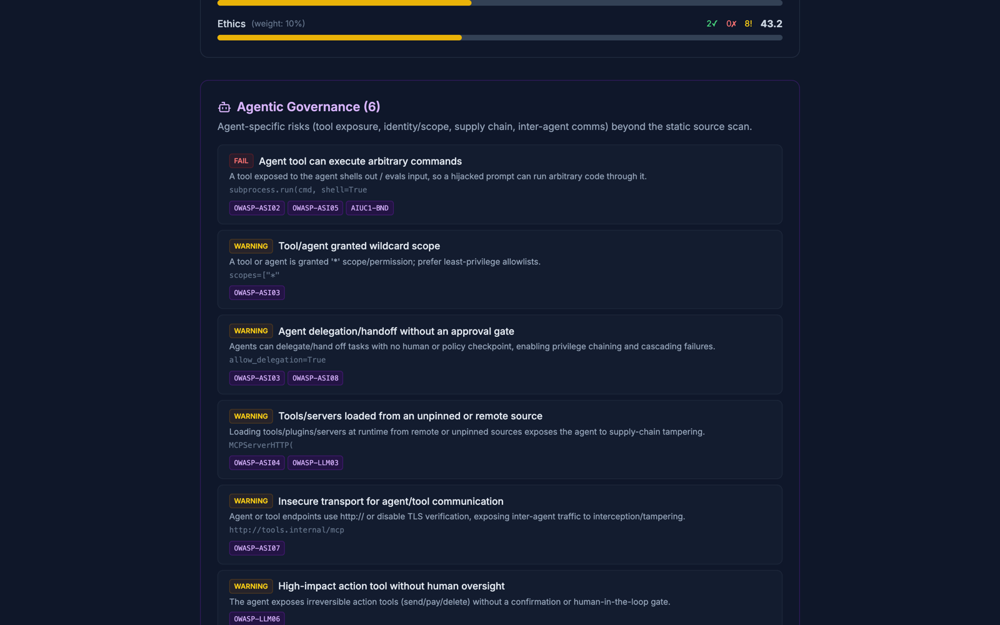
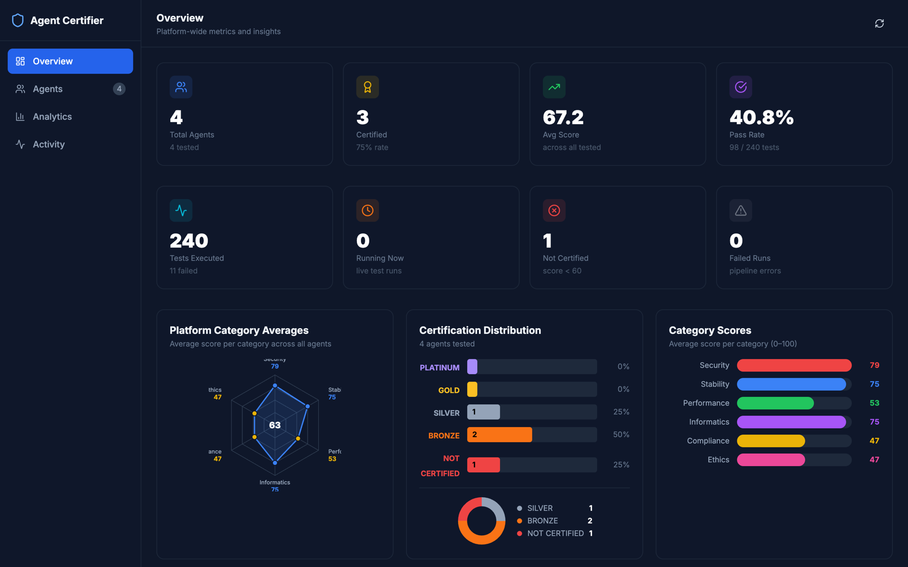
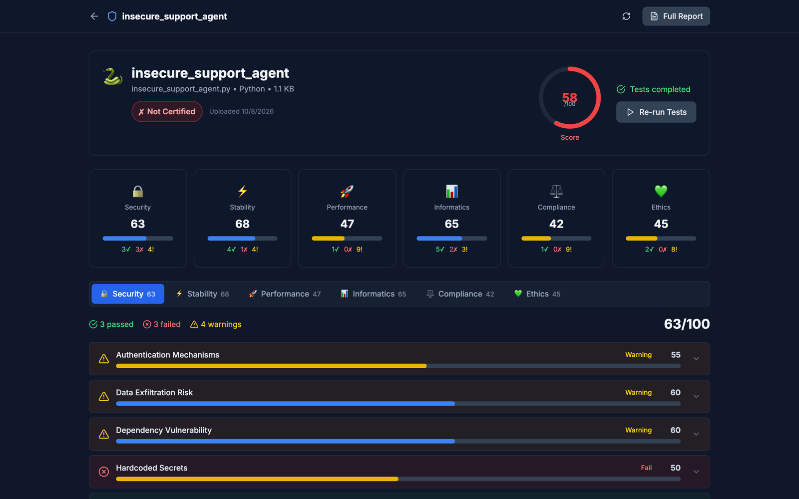
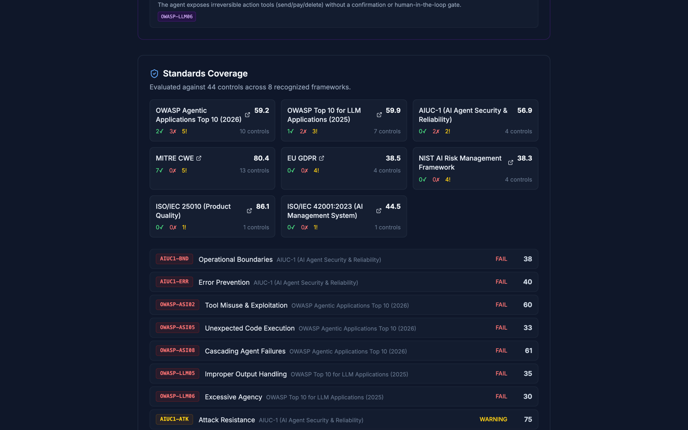

# Agent Certifier

[](https://github.com/sandeepvijayarao09/Agent-Certifier/actions/workflows/ci.yml)
[](LICENSE)

Static security and quality scanner for AI agent code. Upload an agent file and get 60 checks across six categories, a weighted score, a certification tier, and a report mapped to the OWASP Agentic Top 10 (2026), OWASP LLM Top 10 (2025), CWE, GDPR, ISO/IEC 42001, NIST AI RMF and AIUC-1.



## Highlights

- **60 checks, 6 analyzers**: security, stability, performance, informatics, compliance, ethics (`backend/app/services/analyzer/`). Pure static analysis with regex patterns and heuristics; uploaded code is never executed.
- **Standards coverage**: every check maps to controls in 8 frameworks, and each report rolls results up per control and per framework (`analyzer/standards.py`).
- **Agentic governance lane**: flags agent-specific risks in ADK, LangChain, LangGraph, CrewAI, AutoGen and MCP code and in A2A Agent Cards / MCP configs (`.json`): shell-out tools, wildcard scopes, unguarded delegation, non-TLS agent endpoints.
- **Hardened API**: upload validation and size limits, per-client rate limits, security headers, and analyzers run in separate processes that are hard-killed on timeout (`services/orchestrator.py`).
- **Dashboard and reports**: platform analytics, per-agent drill-down, JSON report/certificate download and a print-friendly report view.
- **Tested**: 25 pytest tests (API flow, hardening, orchestrator, standards, agentic lane) plus frontend typecheck and production build in CI.

| Dashboard | Agent results | Standards coverage |
|---|---|---|
|  |  |  |

Screenshots are from a local run against the files in [`examples/`](examples/).

## Quick start

### Docker Compose

```bash
git clone https://github.com/sandeepvijayarao09/Agent-Certifier.git
cd Agent-Certifier
docker-compose up --build
```

- Frontend: http://localhost:3000
- Backend API: http://localhost:8000 (interactive docs at http://localhost:8000/docs)

### Manual setup

Backend (Python 3.11+):

```bash
cd backend
python -m venv .venv && source .venv/bin/activate
pip install -r requirements.txt
uvicorn app.main:app --reload --port 8000
```

Frontend (Node 20):

```bash
cd frontend
npm ci
npm run dev
```

The frontend talks to `http://localhost:8000` by default; set `NEXT_PUBLIC_API_URL` to point it elsewhere. Backend settings (database URL, CORS origins, upload and rate limits) live in `backend/app/core/config.py` and can be overridden with environment variables or a `backend/.env` file.

## Usage

Open http://localhost:3000, drop in an agent file (`.py .js .ts .go .java .rb .rs .cpp .cc .cs .php .json`) and run the tests. To try it without your own code, upload the samples in [`examples/`](examples/):

| File | What it shows | Result on a local run |
|---|---|---|
| `hardened_agent.py` | Input sanitization, timeouts, PII redaction, human escalation | 78.9, SILVER |
| `mcp_ops_agent.py` | Shell-out MCP tool, wildcard scope, delegation, `http://` tool server | 65.3, BRONZE, 6 agentic findings |
| `agent_card.json` | A2A Agent Card with a non-TLS URL and no security scheme | 66.9, BRONZE, agentic findings |
| `insecure_support_agent.py` | Hardcoded credential, prompt injection, `exec`/`eval`, shell and SQL injection, `pickle` | 57.7, NOT_CERTIFIED |

Or drive the API directly:

```bash
ID=$(curl -s -F "file=@examples/insecure_support_agent.py" localhost:8000/api/agents/upload | python -c "import sys,json;print(json.load(sys.stdin)['id'])")
curl -s -X POST localhost:8000/api/agents/$ID/run
curl -s localhost:8000/api/agents/$ID/report    # once status is "completed"
```

## How scoring works

- Each check returns a score from 0 to 100 and a status (pass, warning, fail).
- A category score is the mean of its 10 checks. The overall score weights the categories: Security 30%, Stability 20%, Performance 15%, Informatics 15%, Compliance 10%, Ethics 10%.
- Tiers: PLATINUM (90+), GOLD (80+), SILVER (70+), BRONZE (60+), NOT_CERTIFIED (below 60).
- The agentic governance lane is advisory. It feeds Standards Coverage but does not change the weighted score.

### Limitations

- It's pattern matching, not program analysis. Expect false positives (a string that looks like a secret) and false negatives (an injection the regexes don't recognize).
- Checks that look for good practice (docs, logging, consent handling) reward their presence, so short or non-code files score in the middle rather than at zero. That's why the Agent Card above lands at BRONZE on the core score even though its agentic findings are real.
- A certification tier here is a signal for review, not an audit or a compliance attestation.

## Architecture

- **Backend**: FastAPI, async SQLAlchemy and SQLite. Analyzers run in a process pool with per-category timeouts.
- **Frontend**: Next.js 14, TypeScript and Tailwind CSS.
- **CI**: GitHub Actions runs pytest and the frontend typecheck and build on every push to `main` and on pull requests.

## Testing

Backend:

```bash
cd backend
pip install -r requirements.txt -r requirements-dev.txt
pytest
```

Frontend (typecheck and production build):

```bash
cd frontend
npm ci
npx tsc --noEmit && npm run build
```

## Test Categories

| Category | Weight | Tests |
|----------|--------|-------|
| Security | 30% | Injection, Secrets, Prompt Injection, Exfiltration, Auth, Input Validation, Dependencies, Privilege Escalation, Info Disclosure, LLM Code Injection |
| Stability | 20% | Error Handling, Infinite Loops, Recursion, Resource Leaks, Timeouts, Graceful Degradation, State Management, Memory, Concurrency, Exception Specificity |
| Performance | 15% | Caching, Async I/O, Batch Processing, Connection Pooling, Lazy Loading, Algorithm Complexity, Streaming, Rate Limiting, Resource Cleanup, Token Optimization |
| Informatics | 15% | Complexity, Documentation, Modularity, Type Annotations, Response Format, Logging, Config Externalization, API Contracts, Naming, Duplication |
| Compliance | 10% | PII Handling, Data Retention, Audit Logging, GDPR, Licensing, ToS, Output Filtering, User Consent, Data Minimization, Regulatory Awareness |
| Ethics | 10% | Bias Detection, Transparency, Human Oversight, Refusal Mechanisms, Fairness, Explainability, Harm Prevention, Misinformation, Manipulation, Accountability |

## Standards Coverage

Every test is mapped to recognized industry frameworks, and each report includes
a **Standards Coverage** section (`standards_coverage` + `frameworks` in the
report/certificate JSON) showing which controls the agent passes or fails. A
control's status is the most severe result among the tests mapped to it. Mapped
frameworks:

| Framework | Example controls |
|-----------|------------------|
| [OWASP Top 10 for Agentic Applications (2026)](https://genai.owasp.org/resource/owasp-top-10-for-agentic-applications-for-2026/) | ASI01 Goal Hijack, ASI03 Identity & Privilege Abuse, ASI05 Unexpected Code Execution |
| [OWASP Top 10 for LLM Applications (2025)](https://genai.owasp.org/llm-top-10/) | LLM01 Prompt Injection, LLM02 Sensitive Info Disclosure, LLM10 Unbounded Consumption |
| [MITRE CWE](https://cwe.mitre.org/) | CWE-78, CWE-89, CWE-502, CWE-798 (deep-linked per weakness) |
| [EU GDPR](https://gdpr-info.eu/) | Art. 5, 7, 30, 32 |
| [ISO/IEC 42001:2023](https://www.iso.org/standard/42001) | AI management system (governance, transparency, traceability) |
| [ISO/IEC 25010](https://iso25000.com/index.php/en/iso-25000-standards/iso-25010) | Maintainability / product quality |
| [NIST AI RMF](https://www.nist.gov/itl/ai-risk-management-framework) | GOVERN, MAP, MEASURE, MANAGE |
| AIUC-1 | Attack Resistance, Data Protection, Operational Boundaries, Error Prevention |

The per-test mapping lives in `backend/app/services/analyzer/standards.py`.

## Agentic Governance

When an uploaded file is agent/tool code (ADK, LangChain, LangGraph, CrewAI,
AutoGen, MCP) or a JSON manifest (A2A Agent Card, MCP server config), the report
adds an **Agentic Governance** section covering the OWASP Agentic controls the
static source scan can't reach: **ASI02** tool misuse, **ASI03** identity &
privilege, **ASI04** supply chain, **ASI07** inter-agent communication, and
**LLM06** excessive agency. It flags things like a tool that shells out,
wildcard scopes, unguarded agent-to-agent delegation, http:// (non-TLS) agent
endpoints, and Agent Cards with no declared security scheme.

This lane is **advisory** — it enriches Standards Coverage but does not change
the weighted 60-test score, and it stays silent for non-agent code. It lives in
`backend/app/services/analyzer/agentic.py`.

## License

MIT. See [LICENSE](LICENSE).
